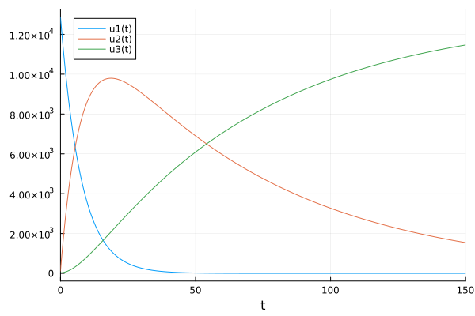
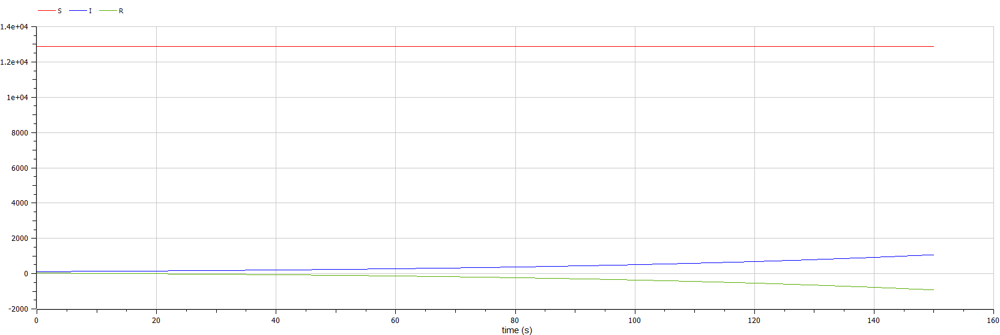
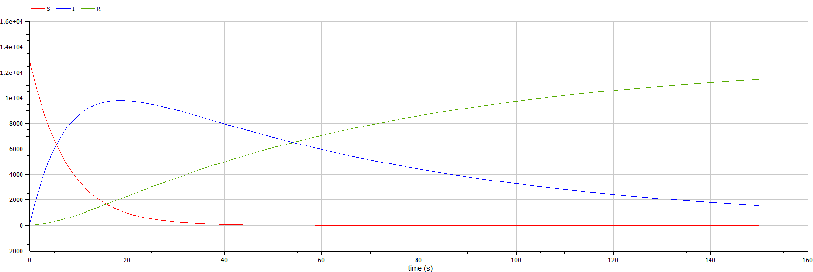

---
# Front matter
lang: ru-RU
title: "Отчет по лабораторной работе №6"
subtitle: "Модель эпидемии - вариант 69"
author: "Любимов Дмитрий Андреевич	Нфибд 01-20"

# Formatting
toc-title: "Содержание"
toc: true # Table of contents
toc_depth: 2
lof: true # List of figures
fontsize: 12pt
linestretch: 1.5
papersize: a4paper
documentclass: scrreprt
polyglossia-lang: russian
polyglossia-otherlangs: english
mainfont: PT Serif
romanfont: PT Serif
sansfont: PT Sans
monofont: PT Mono
mainfontoptions: Ligatures=TeX
romanfontoptions: Ligatures=TeX
sansfontoptions: Ligatures=TeX,Scale=MatchLowercase
monofontoptions: Scale=MatchLowercase
indent: true
pdf-engine: lualatex
header-includes:
  - \linepenalty=10 # the penalty added to the badness of each line within a paragraph (no associated penalty node) Increasing the υalue makes tex try to haυe fewer lines in the paragraph.
  - \interlinepenalty=0 # υalue of the penalty (node) added after each line of a paragraph.
  - \hyphenpenalty=50 # the penalty for line breaking at an automatically inserted hyphen
  - \exhyphenpenalty=50 # the penalty for line breaking at an explicit hyphen
  - \binoppenalty=700 # the penalty for breaking a line at a binary operator
  - \relpenalty=500 # the penalty for breaking a line at a relation
  - \clubpenalty=150 # extra penalty for breaking after first line of a paragraph
  - \widowpenalty=150 # extra penalty for breaking before last line of a paragraph
  - \displaywidowpenalty=50 # extra penalty for breaking before last line before a display math
  - \brokenpenalty=100 # extra penalty for page breaking after a hyphenated line
  - \predisplaypenalty=10000 # penalty for breaking before a display
  - \postdisplaypenalty=0 # penalty for breaking after a display
  - \floatingpenalty = 20000 # penalty for splitting an insertion (can only be split footnote in standard LaTeX)
  - \raggedbottom # or \flushbottom
  - \usepackage{float} # keep figures where there are in the text
  - \usepackage{amsmath}
  - \floatplacement{figure}{H} # keep figures where there are in the text
---

# Цель работы

Изучить модель эпидемии $SIR$

# Задание

1.	Изучить модель эпидемии
2.	Построить графики изменения числа особей в каждой из трех групп. Рассмотреть, как будет протекать эпидемия в случае: $I(0)\leq I^*$, $I(0)>I^*$


# Выполнение лабораторной работы

## Теоретические сведения

Рассмотрим простейшую модель эпидемии. Предположим, что некая популяция, состоящая из $N$ особей, (считаем, что популяция изолирована) подразделяется на три группы. Первая группа - это восприимчивые к болезни, но пока здоровые особи, обозначим их через $S(t)$. Вторая группа – это число инфицированных особей, которые также при этом являются распространителями инфекции, обозначим их $I(t)$. А третья группа, обозначающаяся через $R(t)$ – это здоровые особи с иммунитетом к болезни. 
До того, как число заболевших не превышает критического значения $I^*$, считаем, что все больные изолированы и не заражают здоровых. Когда $I(t)> I^*$, тогда инфицирование способны заражать восприимчивых к болезни особей. 

Таким образом, скорость изменения числа $S(t)$ меняется по следующему закону:

$$
\frac{dS}{dt}=
 \begin{cases}
	-\alpha S &\text{,если $I(t) > I^*$}
	\\   
	0 &\text{,если $I(t) \leq I^*$}
 \end{cases}
$$

Поскольку каждая восприимчивая к болезни особь, которая, в конце концов, заболевает, сама становится инфекционной, то скорость изменения числа инфекционных особей представляет разность за единицу времени между заразившимися и теми, кто уже болеет и лечится. Т.е.:

$$
\frac{dI}{dt}=
 \begin{cases}
	\alpha S -\beta I &\text{,если $I(t) > I^*$}
	\\   
	-\beta I &\text{,если $I(t) \leq I^*$}
 \end{cases}
$$

А скорость изменения выздоравливающих особей (при этом приобретающие иммунитет к болезни):

$$\frac{dR}{dt} = \beta I$$

Постоянные пропорциональности $\alpha, \beta$ - это коэффициенты заболеваемости и выздоровления соответственно. Для того, чтобы решения соответствующих уравнений определялось однозначно, необходимо задать начальные условия. Считаем, что на начало эпидемии в момент времени $t=0$ нет особей с иммунитетом к болезни $R(0)=0$, а число инфицированных и восприимчивых к болезни особей $I(0)$ и $S(0)$ соответственно. Для анализа картины протекания эпидемии необходимо рассмотреть два случая:  $I(0) \leq I^*$ и  $I(0)>I^*$

## Задача

На одном острове вспыхнула эпидемия. Известно, что из всех проживающих на острове 
$(N=13013)$ в момент начала эпидемии $(t=0)$ число заболевших людей 
(являющихся распространителями инфекции) $I(0)=113$, А число здоровых людей с иммунитетом 
к болезни $R(0)=31$. Таким образом, число людей восприимчивых к болезни, 
но пока здоровых, в начальный момент времени $S(0)=N-I(0)-R(0)$.
Постройте графики изменения числа особей в каждой из трех групп.

Рассмотрите, как будет протекать эпидемия в случае:
1.	$I(0)\leq I^*$
2.	$I(0)>I^*$


Решение в Julia

```
1032200538%70+1

using Plots
using DifferentialEquations

S = 13013-113-31
I = 113
R = 31

a = 0.13
b = 0.015
tspan = (0, 150)
t = collect(LinRange(0, 150, 1000))
u0 = [S; I; R]

function syst(dy, y, p, t)
    dy[1] = 0
    dy[2] = b*y[2]
    dy[3] = -b*y[2]
end

prob = ODEProblem(syst, u0, tspan)
sol = solve(prob, saveat=t)

plot(sol)

savefig("01.png")

function syst(dy, y, p, t)
    dy[1] = -a*y[1]
    dy[2] = a*y[1]-b*y[2]
    dy[3] = b*y[2]
end

prob = ODEProblem(syst, u0, tspan)
sol = solve(prob, saveat=t)

plot(sol)

savefig("02.png")
```

{ #fig:003 width=70% height=70% }

{ #fig:004 width=70% height=70% }

Решение в OpenModelica

```
model pr6

parameter Real a = 0.13;
parameter Real b = 0.015;

Real S(start=12869);
Real I(start=113);
Real R(start=31);

equation
  der(S)=0;
  der(I)=b*I;
  der(R)=-b*I;

end pr6;
```

```
model pr6

parameter Real a = 0.13;
parameter Real b = 0.015;

Real S(start=12869);
Real I(start=113);
Real R(start=31);

equation
  der(S) = -a*S;
  der(I) = a*S-b*I;
  der(R) = b*I;
end pr6;
```

{ #fig:001 width=70% height=70% }

{ #fig:002 width=70% height=70% }


# Выводы

В ходе выполнения лабораторной работы я изучил модель эпидемии и построил графики в Julia и OpenModelica.

# Список литературы {.unnumbered}

1. [Конструирование эпидемиологических моделей](https://habr.com/ru/post/551682/)
2. [Зараза, гостья наша](https://nplus1.ru/material/2019/12/26/epidemic-math)
